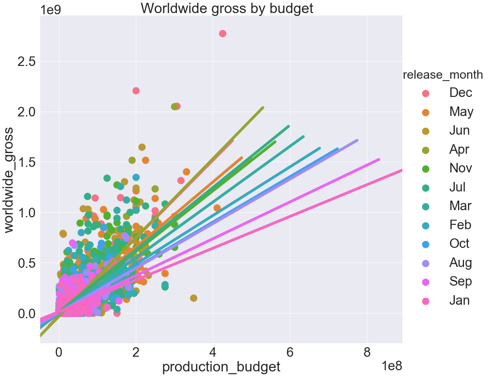
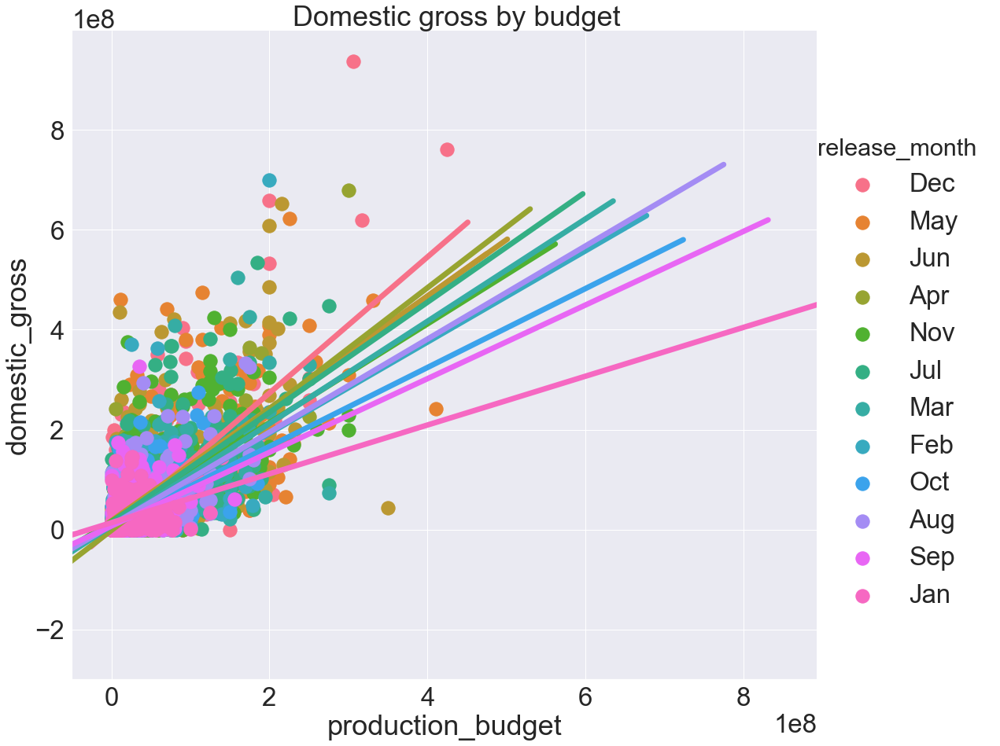

 # Movie production Project 
 
 This project was created to answer the essential questions of a large business getting into the movie industry. These questions are:
 
  1) What are the movie genres that make the most money?
  
  2) How to hire a film crew to make the highest grossing movies?
  
  3)  What are the budgets of top performing movies?
  
  At what time of the year should the movie be released?
  
  
  
 
  ## Datasets
 
 The data sources are IMDB, Box office and The Movie DB. 3 datasets were used after exploring 13 of them.
 
 
 
 ## Recommendations
 
 ### 1) Genre:
 
 The popular genres are Adventure, Science-Fiction, Action, Fantasy, Family. The movie must include 3 of these to get high profit.
 

 
 
 

 ### 2) Hiring: 
 
 Working with the right people will increase the success of the movies. Hire crew from high profit studios. Make them work in correlation. This is going to bring success.
 
 
 
 ### 3) Budget:
 
 In the datasets there is a very strong correlation between the budget of a movie and its revenue. According to the graph high gross movies have high budgets. To gain more, spend more. A budget at around 200 million is going to make a good revenue.
 
 
 
 
 ### 4) Release:
 
 The time pf the year a movie is released is very important in the success. According to the graph the best 3 months to release a movie in US are December, June, May and November. Best moths to release a movie in the world are June and December. But is it necessary to get more information about the seasons, holidays and some other factors affecting the movie customers.
 
 